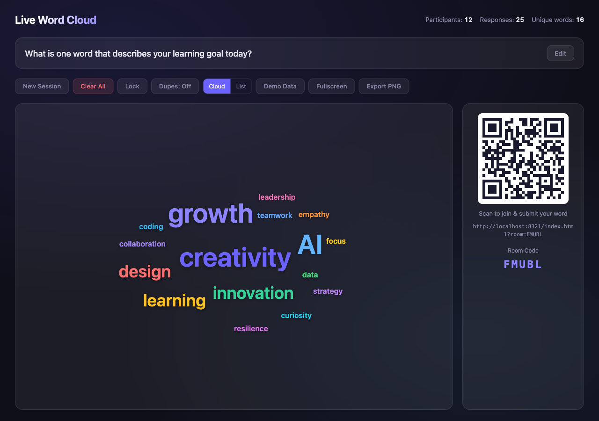

<div align="center">

# Live Word Cloud

[](https://developer.mozilla.org/en-US/docs/Web/HTML)
[](https://developer.mozilla.org/en-US/docs/Web/CSS)
[](https://developer.mozilla.org/en-US/docs/Web/JavaScript)
[](LICENSE)

**A real-time collaborative word cloud for classrooms, workshops, and live events.**

[View Demo](#getting-started) · [Report Bug](https://github.com/alfredang/wordcloud/issues) · [Request Feature](https://github.com/alfredang/wordcloud/issues)

</div>

## Screenshot



## About

Live Word Cloud is a single-file web app that lets facilitators pose a question on screen while participants submit words from their phones via QR code. All responses appear instantly in a beautiful, animated word cloud — with more popular words displayed larger.

### Key Features

- **Real-time collaboration** — Submissions appear instantly across all connected devices
- **QR code join** — Participants scan to join from any device, no app install needed
- **Live word cloud** — Animated spiral layout with frequency-based sizing and color variation
- **Facilitator controls** — Edit question, lock/unlock submissions, toggle duplicates, new session, clear all
- **Presentation-ready** — Fullscreen mode, dark glassmorphism design, export as PNG
- **Cloud & list views** — Toggle between word cloud and ranked list
- **Anti-spam** — Rate limiting, profanity filter, input validation
- **Zero dependencies** — Single HTML file, no build tools, no backend required
- **Demo mode** — Load sample data to preview the word cloud instantly

## Tech Stack

| Layer | Technology |
|-------|-----------|
| **Frontend** | HTML5, CSS3, Vanilla JavaScript |
| **Real-time Sync** | BroadcastChannel API, localStorage events, polling fallback |
| **QR Generation** | [qrcode-generator](https://github.com/nicklockwood/qrcode-generator) (CDN) |
| **Design** | Glassmorphism, CSS custom properties, responsive layout |

## Architecture

```
┌─────────────────────────────────────────────────┐
│                  index.html                      │
│                                                  │
│  ┌──────────────┐        ┌───────────────────┐  │
│  │  Facilitator  │◄──────►│   localStorage    │  │
│  │    View       │        │  + Broadcast-     │  │
│  │  (word cloud, │        │    Channel        │  │
│  │   QR, stats)  │        │  (cross-tab sync) │  │
│  └──────────────┘        └───────────────────┘  │
│                                  ▲               │
│  ┌──────────────┐                │               │
│  │  Participant  │◄──────────────┘               │
│  │    View       │                               │
│  │  (input form, │                               │
│  │   feedback)   │                               │
│  └──────────────┘                                │
└─────────────────────────────────────────────────┘
```

## Getting Started

### Prerequisites

- Any modern web browser (Chrome, Firefox, Safari, Edge)
- A local HTTP server (for cross-tab real-time sync)

### Running Locally

1. Clone the repository:
   ```bash
   git clone https://github.com/alfredang/wordcloud.git
   cd wordcloud
   ```

2. Start a local server:
   ```bash
   python3 -m http.server 8080
   ```

3. Open the facilitator view:
   ```
   http://localhost:8080/index.html
   ```

4. Scan the QR code or open the join link on another device/tab to submit words.

### Quick Demo

Click **Demo Data** in the toolbar to instantly populate the word cloud with sample words.

## How It Works

1. **Facilitator** opens the app and a unique room is created automatically
2. A **QR code** and join URL are displayed for participants
3. **Participants** scan the QR code, see the question, and submit words
4. Words are synced in real-time via `BroadcastChannel` + `localStorage`
5. The **word cloud** renders with spiral placement — frequent words appear larger
6. Facilitator can lock submissions, clear data, export PNG, or start a new session

## Deployment

This is a single HTML file — deploy anywhere that serves static files:

- **GitHub Pages** — Push and enable Pages in repo settings
- **Vercel** — `vercel deploy`
- **Netlify** — Drag and drop the file
- **Any web server** — Just serve `index.html`

> **Note:** For multi-device real-time sync beyond the same browser, connect a backend (WebSocket, Firebase, or Supabase). The code is structured to make this straightforward.

## Contributing

1. Fork the repository
2. Create your feature branch (`git checkout -b feature/amazing-feature`)
3. Commit your changes (`git commit -m 'feat: add amazing feature'`)
4. Push to the branch (`git push origin feature/amazing-feature`)
5. Open a Pull Request

## License

Distributed under the MIT License. See `LICENSE` for more information.

## Acknowledgements

- [qrcode-generator](https://github.com/nicklockwood/qrcode-generator) — QR code generation
- Built with vanilla HTML, CSS, and JavaScript
